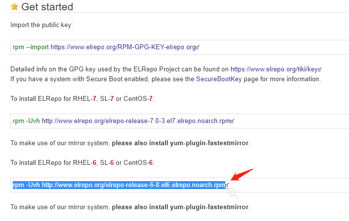

在上一篇docker的安装教程中，我遇到了虚拟机打开报无法连接mks的错误，在管理中把虚拟机相关的服务重启一下就可以了。

重启完又发现我虚拟机的内核低于docker的3.0的要求，所以今天就来做一下内核的升级这种骚操作。


<!--more-->

```
cat /proc/version
cat /etc/issue      #查看系统版本
 ```

导入公钥：
```
rpm --import https://www.elrepo.org/RPM-GPG-KEY-elrepo.org
```

可以去[ELRepo](http://elrepo.org/tiki/tiki-index.php)看看。

```
rpm -Uvh http://www.elrepo.org/elrepo-release-6-8.el6.elrepo.noarch.rpm
```


安装kernel
```
yum --enablerepo=elrepo-kernel install kernel-lt -y
```

安装完成后，修改default 选择默认引导的版本为刚安装的最新版：
```
vi /etc/grub.conf
```

![vi]CentOS内核升级4-4-12教程/vi.png)

保存修改，然后重启。

