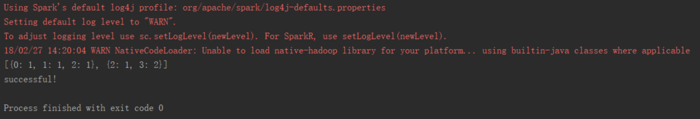

想在搭建个环境试试spark，看到有人说在windows系统搭建纯粹属于浪费时间……

但是虚拟机搭建了别的环境，怕冲突，也嫌麻烦，就先在windos系统搭建下试试吧，鼓捣鼓捣也顺便把过程记录下来。

顺手记一下，方便你我他。

<!--more-->
#### 第一步
安装Anaconda，官网直接下载，我选的2.7的64位版本：[呐，点我](https://repo.continuum.io/archive/Anaconda2-5.1.0-Windows-x86_64.exe)
安装时记得勾选添加path

在系统变量添加path


然后开个命令行窗口，输入下 python 测试是否成功安装


#### 第二步
下载spark，直接最新版好了，2.21：[呐，点我](https://www.apache.org/dyn/closer.lua/spark/spark-2.2.1/spark-2.2.1-bin-hadoop2.7.tgz)
下载解压后，自己建个目录，把解压后的东西复制进去，再添加SPARK_HOME = C:\spark，path中再添加两个：%SPARK_HOME%\bin，%SPARK_HOME%\sbin

#### 第三步
下载hadoop：[2.7.0](https://github.com/steveloughran/winutils)，其实只需要bin下边一个 winutils.exe
下载后存放在 C:\winutils\bin 文件夹下，再添加系统变量 HADOOP_HOME = C:\winutils

开个命令行，执行 pyspark-shell，出现以下画面就好了：


#### 第四步
Python 直接下载集成环境 Anaconda Navigator ，然后用命令通过 pip 下载 pypark

```shell
pip install pyspark
```
如果出现pip无法识别，执行下 
```
python -m pip install -U pip
```

#### 第五步
在 pycharm 中添加 SPARK_HOME 和 PYTHONPATH（这一步少了会有一堆莫名其妙的错误） :
```
SPARK_HOME:C:\Users\wu\Anaconda2\Lib\site-packages\pyspark
PYTHONPATH:C:\Users\wu\Anaconda2\Lib\site-packages\pyspark\python
```
_* 2018-3-7_
这里更新一下，在pycharm创建项目的时候，把 python 源选为下载的 Anaconda2 即可省去这一步，如下图：


#### 第六步
网上找段代码，开始测试：
```
from pyspark import SparkContext

sc = SparkContext("local","Simple App")
doc = sc.parallelize([['a','b','c'],['b','d','d']])
words = doc.flatMap(lambda d:d).distinct().collect()
word_dict = {w:i for w,i in zip(words,range(len(words)))}
word_dict_b = sc.broadcast(word_dict)

def wordCountPerDoc(d):
    dict={}
    wd = word_dict_b.value
    for w in d:
        if dict.get(wd[w],0):
            dict[wd[w]] +=1
        else:
            dict[wd[w]] = 1
    return dict
print(doc.map(wordCountPerDoc).collect())
print("successful!")
```


