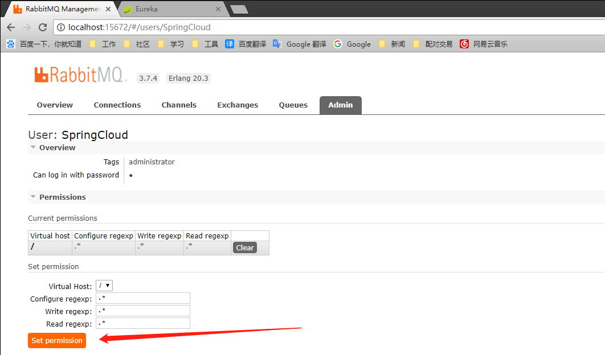
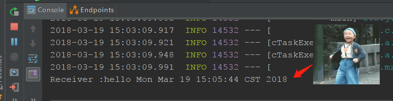

在微服务架构的系统中，通常会使用轻量级的消息代理来构建一个共同的消息主题让系统中的所有服务都连接上来。这个消息主题，就是消息总线组件。
在总线上各个实例都可以方便地广播一些需要让其他服务知道的消息，例如配置信息的变更或其他的一些管理操作等。

<!--more-->
## RabbitMQ实现消息总线

RabbitMQ是实现了高级消息队列协议的开源消息代理软件，也称为面向消息的中间件。

#### 安装

RabbitMQ需要单独下载安装，因为其是使用Erlang语言开发的，所以需要先把Erlang安装好:

[点我下载Erlang](http://www.erlang.org/downloads)
[点我下载RabbitMQ](http://www.rabbitmq.com/download.html)

安装完成后，先打开RabbitMQ自带的启动工具开启服务，然后在命令行工具中执行以下命令来开启web管理插件：
```
rabbitmq-plugins enable rabbitmq_management
```

启动后访问 localhost:15672/#/，默认帐号密码均为 guest


在admin选项卡内创建一个SpringCloud的新用户：

分配下权限：



#### 创建项目

创建boot项目，勾选 RabbitMQ组件，然后填写配置信息：
```
spring.application.name=rabbitmq-server
spring.rabbitmq.host=localhost
spring.rabbitmq.port=8089
spring.rabbitmq.username=SpringCloud
spring.rabbitmq.password=SpringCloud

```

创建消息生产者 Sender:
```
@Component
public class Sender {
    @Autowired
    private AmqpTemplate rabbitTemplate;

    public void send(){
        String context = "hello " + new Date();
        System.out.println("Sender :" + context);
        this.rabbitTemplate.convertAndSend("hello",context);
    }
}
```

创建消息消费者：
```
@Component
@RabbitListener(queues = "hello")
public class Receiver {
    
    @RabbitHandler
    public void process(String hello) {
        System.out.println("Receiver :" + hello);
    }

}
```

创建配置类：
```
@Configuration
public class RabbitConfig {
    @Bean
    public Queue helloQueue() {
        return new Queue("hello");
    }
}
```

这里的Quene引用 amqp.core.Queue

单元测试类添加代码：
```
public class RabbitmqApplicationTests {

	@Autowired
	private Sender sender;

	@Test
	public void contextLoads() {
		sender.send();
	}

}
```

#### 运行测试

运行，刷新页面


这里没有成功的话一般有两个错误，连接被拒绝和无法注册Queue，第一个请检查权限和用户名密码是否正确，guest的用户好像也是不能在程序中用的。第二个就看下是不是导错了包。

然后运行test



## 整合Spring Cloud Bus
改造上一个项目中的config-client的configClientController
添加一个注解：@RefreshScope

在application的配置文件中添加RabbitMQ的配置：
```
spring.rabbitmq.host=localhost
spring.rabbitmq.port=5672
spring.rabbitmq.username=SpringCloud
spring.rabbitmq.password=SpringCloud
```

发现在config项目里有个问题，refresh不能用，每次都返回404，暂未找到解决方法，so，解决了再说。

_<font color=red>更新于 2018-03-20</font>_

发现是因为actuator加载后只有 info 和 health 默认是打开的，而且需要在url加一层 actuator，别的都需要手动开启,在配置文件加一句：
```
management.endpoints.web.exposure.include=health,info,beans,refresh
or
management.endpoints.web.exposure.include=*
```


postman 来访问一下，用post方式


刷新页面


ok，这一步算是搞定了，忍不住想吐槽一下，真特么的坑！

_<font color=red>更新于 2018-03-22 注：关于 bus/refresh</font>_
传说中的这个刷新配置的url在n多年前已经失效了，折腾了多天之后终于知道问题的解决办法了：

在配置文件中添加注解
```
<dependency>
    <groupId>org.springframework.boot</groupId>
    <artifactId>spring-boot-starter-actuator</artifactId>
</dependency>
<dependency>
    <groupId>org.springframework.boot</groupId>
    <artifactId>spring-boot-starter-amqp</artifactId>
</dependency>
<dependency>
    <groupId>org.springframework.cloud</groupId>
    <artifactId>spring-cloud-bus</artifactId>
</dependency>
<dependency>
    <groupId>org.springframework.cloud</groupId>
    <artifactId>spring-cloud-stream-binder-rabbit</artifactId>
</dependency>
```

然后postman访问 <font color=red>localhost:8088/actuator/bus-refresh </font>就可以了，正常应该是没返回值的，但是结果还是会刷新的。至少我是这样。

欲仙欲死的感觉真棒！
