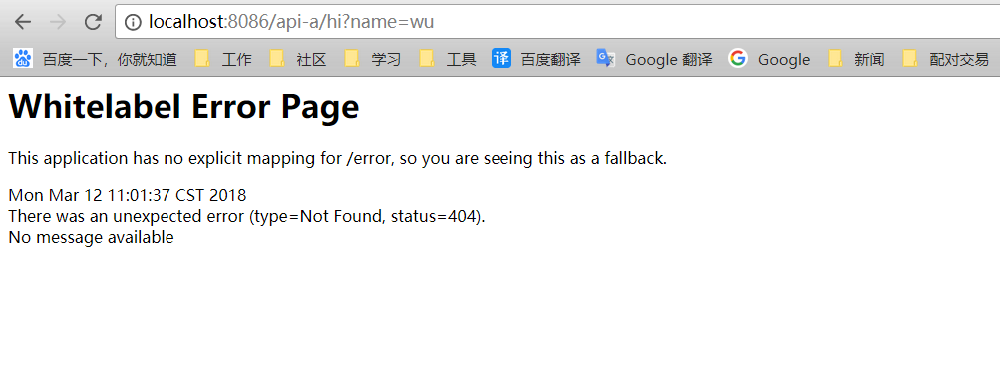

前边几篇介绍的都是spring cloud netflix 下的核心组件，通过这几个组件已经可以构建起一个简单的微服务架构系统，虽然用这套架构实现系统功能已经完全没问题，但还是存在一些问题会使运维和开发感到痛苦。比如路由规则。

为了解决这个问题，API网关的概念应运而生。

它的存在就像是整个微服务架构系统的门面一样，所有外部客户端的访问都需要经过它的过滤和筛选。在spring大礼包中，它的存在就是API网关组件------Spring Cloud Zuul。


<!--more-->
#### 第一步
新建项目，勾选server和zuul组件，然后在主类添加注解：
```
@SpringBootApplication
@EnableZuulProxy
public class ZuulApplication {

	public static void main(String[] args) {
		SpringApplication.run(ZuulApplication.class, args);
	}
}
````

#### 第二步
添加配置内容：
```
spring.application.name=Zuul-service
server.port=8086
eureka.instance.hostname=localhost
eureka.client.serviceUrl.defaultZone=http://${eureka.instance.hostname}:8081/eureka/

#定义路由转发
zuul.routes.api-a.path=/api-a/**
zuul.routes.api-a.url=http://localhost:8082/
```

_<font color=red>注：</font>_
定义路由转发一定不要忘了后边的两个**，否则就会出现下边的画面：


#### 第三步
很明显，上边的路由配置对我们来说并不友好，同样需要我们花费大量事件去维护各个路由的path和url的关系，所以下边就把它改为面向服务的配置方式：
```
zuul.routes.api-a.path=/api-a/**
zuul.routes.api-a.serviceId=Client-service

zuul.routes.api-b.path=/api-b/**
zuul.routes.api-b.serviceId=Feign-service
```
重启完直接访问 localhost:8086/api-b/hi?name=wu，刷新页面，会看到在两个端口上自动切换。我们的目的也就达到了。

#### 第四步
请求路由功能实现以后，所有的请求都会毫无保留的转发个具体的应用并返回结果，安全起见，我们需要对请求进行检查。

创建新类 zuulFilter:
```
@Component
public class zuulFilter extends ZuulFilter {

    private static org.slf4j.Logger log = LoggerFactory.getLogger(zuulFilter.class);

    @Override
    public String filterType(){
        return "pre";
    }

    @Override
    public int filterOrder(){
        return 0;
    }

    @Override
    public boolean shouldFilter() {
        return true;
    }
    @Override
    public Object run() {
        RequestContext ctx = RequestContext.getCurrentContext();
        HttpServletRequest request = ctx.getRequest();

        Object accessToken = request.getParameter("token");

        if(accessToken == null) {
            ctx.setSendZuulResponse(false);
            ctx.setResponseStatusCode(401);
            ctx.setResponseBody("your token is empty");
            return null;
        }

        log.info("token is ok");
        log.info(accessToken.toString());
        return null;
    }
}
```

* filterType：过滤器的类型，决定了过滤器在请求的哪个声明周期执行。这里定义为pre表示请求被路由执行之前执行。
* filterOrder：过滤器的执行顺序。需要执行多个过滤器时使用。
* shouldFilter：判断过滤器是否需要被执行。这里直接返回true，对所有请求生效。
* run：过滤器的具体逻辑。


