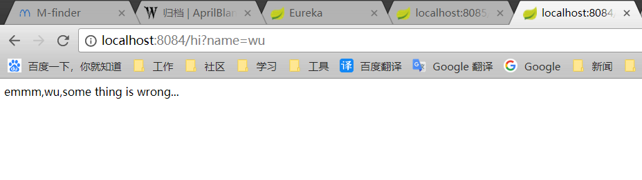

在入门第二篇里已经搞定了两个负载均衡的组件，但是如果多台服务中某个或多个服务出现问题而无法及时反映，那么调用这个服务的线程就会出现阻塞，对微服务造成很大的影响。就个时候，就需要新的组件来支持了，这个组件就是断路器Hystrix。


<!--more-->

## 第一章
#### 第一步
因为上一篇最后是配置的Feign，所以这一步偷个懒，也先从Feign的断路器开始好了。

因为Feign默认是自带断路器的，所以这一步不用创建新项目，直接在Feign的项目中创建新的文件：FeignServiceHystrix
```
@Component
public class FeignServiceHystrix implements FeignService{

    @Override
    public String sayHiFromClient(String name){
        return "sorry " + name;
    }
}
```

然后在FeignService中的注解FeignClient增加Fallback：
```
@FeignClient(value="Client-service",fallback = FeignServiceHystrix.class)
```
最后在配置文件中打开Hystrix：
```
feign.hystrix.enabled=true
```

#### 第二步
重启，然后关闭一个服务，刷新页面会看到下边的画面：

当服务停机无法访问时，可以在这个方法中处理一些事件或者返回一些特定的参数。

## 第二章
开始Ribbon版的断路器吧
#### 第一步
打开Ribbon项目，在RibbonApplication启动器中添加注解：
```
@EnableHystrix
```

添加hystrix依赖：
```
<dependency>
    <groupId>org.springframework.cloud</groupId>
    <artifactId>spring-cloud-starter-netflix-hystrix</artifactId>
</dependency>
```

在HelloServer类添加注解和方法：
```
@HystrixCommand(fallbackMethod = "hiError")
    public String hiService(String name) {
        return restTemplate.getForObject("http://Client-service/hi?name=" + name, String.class);
    }

    public String hiErrot(String name){
        return "emmm," +name + ",some thing is wrong...";
    }
```

#### 第二步
访问 localhost:8084/hi?name=wu，会看到如下画面：

Ok,恭喜你又搞定一个组件，以后再创建Ribbon服务记着直接把Hystrix勾选。
