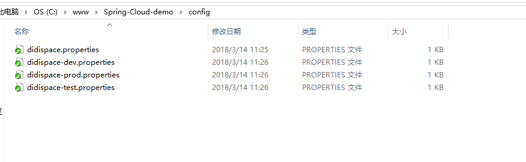
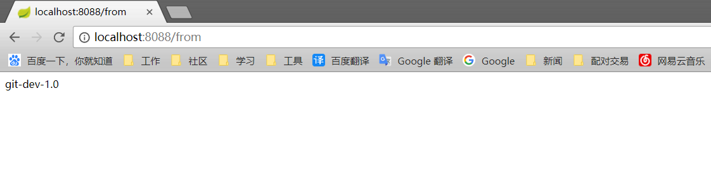
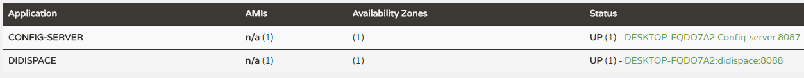

Spring Cloud Config 用来为分布式系统中的基础设施和微服务应用提供集中化的外部配置支持，分为服务端和客户端两个部分。
其中服务端也成为分布式配置中心，是一个独立的微服务应用，用来连接配置仓库并为客户端提供配置信息、加解密等访问接口；客户端则是微服务架构中的各个微服务应用或基础设施，通过指定的配置中心来管理应用资源与业务相关的配置内容，并在启动的时候从配置中心获取和加载配置信息。

<!--more-->
#### 第一步
比较简单，直接创建新项目，勾选config组件。


在入口类加入注解：@EnableConfigServer

然后填写配置文件：
```
spring.application.name=Config-server
server.port=8087

spring.cloud.config.server.git.uri=https://github.com/M-finder/Spring-Cloud-demo
spring.cloud.config.server.git.searchPaths=config
spring.cloud.config.label=master
spring.cloud.config.server.git.username= your name
spring.cloud.config.server.git.password= your password

```

spring.cloud.config.server.git.uri 是指配置文件在git存放的仓库地址
spring.cloud.config.server.git.searchPaths是指配置文件存放的路径

配置信息写好以后去git仓库创建好对应文件夹，然后在文件夹中创建几个.properties文件，


分别写入内容：
```
from=git-default-1.0
from=git-dev-1.0
from=git-prod-1.0
from=git-test-1.0
```

#### 第二步
打开浏览器，访问 localhost:8087/didispace/test/master，会看到如下结果：
```
{
	"name": "didispace",
	"profiles": ["test"],
	"label": "master",
	"version": "08c7404292ea951981e9430e49f923b4d8530f78",
	"state": null,
	"propertySources": [{
		"name": "https://github.com/M-finder/Spring-Cloud-demo/config/didispace-test.properties",
		"source": {
			"from": "git-test-1.0"
		}
	}, {
		"name": "https://github.com/M-finder/Spring-Cloud-demo/config/didispace.properties",
		"source": {
			"from": "git-default-1.0"
		}
	}]
}
```

_<font color=red>注：访问的url对应以下格式</font>_
* /{application}/{profile}[/{label}]
* /{application}-{profile}.yml
* /{application}-{profile}.properties
* /{lable}/{application}-{profile}.properties

配置服务器从git拿到配置信息以后，会在本地缓存一份，当git仓库故障时也可以加载到配置信息。

#### 第三步
创建一个新的config-client项目，新建一个Controller：
```
@RestController
public class ConfigClientController {
    @Value("${from}")
    private String from;

    @RequestMapping("/from")
    public String from() {
        return this.from;
    }
}
```


新建配置文件bootstrap.properties：
```
spring.application.name=didispace
spring.application.config.profile=dev
spring.application.config.label=master
spring.application.config.uri=http://localhost:8087
setver.port=8088
```

启动服务查看效果：


这里会有很多坑，Could not resolve placeholder 'from' in value "${from}" 什么什么的。
第一，请先确认git端的文件名是否和配置文件中的spring.application.name一致;
第二，确认git端文件返回的数据名字是否为from;
第三，确认配置文件是否名为bootstrap；
第四，确认是否把高可用的配置掺进来了。

#### 第四步
像服务注册中心一样，配置中心也可以通过负载均衡来实现高可用，高可用的实现主要有两种方式：
* 传统模式
    将所有server都指向同一个git库，客户端指定server位置时，只需要配置server上层的负载均衡的设备地址即可。
* 服务模式
    将server作为一个普通的微服务应用，纳入服务注册中心的管理，这样就可以通过配置中心的服务名来获取配置信息，比传统模式更利于维护。
    


#### 第五步
指定服务中心的方式就相当于上边的例子，那么再来试一下服务模式吧：

在server 和 client 的配置文件中加入
```
<dependency>
    <groupId>org.springframework.cloud</groupId>
    <artifactId>spring-cloud-starter-netflix-eureka-server</artifactId>
</dependency>
```

server的配置文件中添加：
```
eureka.client.serviceUrl.defaultZone=http://localhost:8081/eureka/
```
这个时候重启的话，可以看到服务中心已经注册了配置中心的服务：


client的配置文件改为：
```
spring.application.name=didispace
spring.cloud.config.label=master
spring.cloud.config.profile=dev

eureka.client.serviceUrl.defaultZone=http://localhost:8081/eureka/
spring.cloud.config.discovery.enabled=true
spring.cloud.config.discovery.serviceId=Config-server
server.port=8088
```

重启，刷新，ok。




