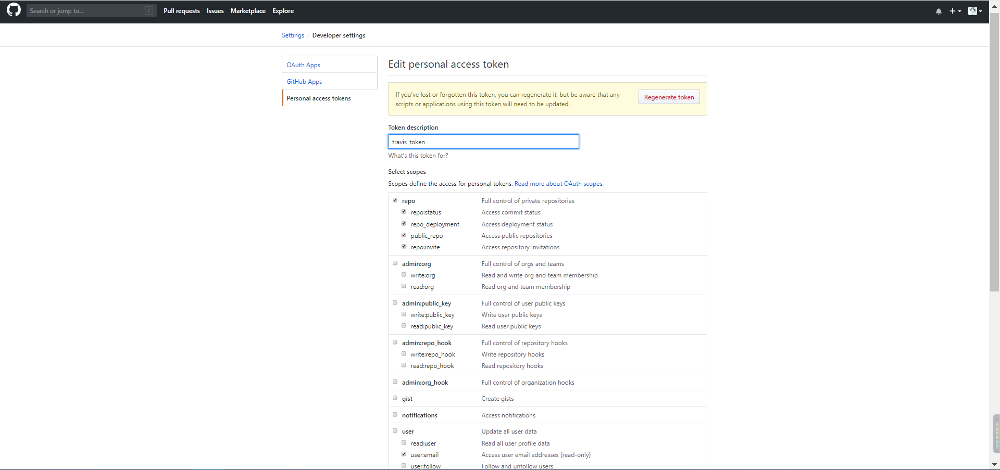

给博客添加了  travis ci 可持续集成，以后本地可以不装 node 环境了。


<!--more-->

## 操作过程：


#### github 账号 登陆 travis ci
登陆后把博客项目的开关打开。


#### 博客项目创建分支
把博客项目，即 .io 的那个项目拉到本地，创建一个新的分支 hexo:

```git

git checkout -b hexo
git rm -rf *    #删除仓库中的文件，可能本地的文件还存有，则需要使用 rm -rf 命令
git commit -m "清空文件夹" #提交删除信息
git push origin hexo:hexo #将删除的信息推送到远程仓库

```

把博客源码放入 hexo 分支的文件夹中，然后再新建 .travis.yml:
```yml

# 指定语言环境
language: node_js
# 指定需要sudo权限
sudo: required
# 指定node_js版本
node_js:
  - 7.9.0
# 指定缓存模块，可选。缓存可加快编译速度。
cache:
  directories:
    - node_modules

# 指定博客源码分支，因人而异。hexo博客源码托管在独立repo则不用设置此项
branches:
  only:
    - hexo

before_install:
  - npm install -g hexo-cli

# Start: Build Lifecycle
install:
  - npm install
  - npm install hexo-deployer-git --save

# 执行清缓存，生成网页操作
script:
  - hexo clean
  - hexo generate

# 设置git提交名，邮箱；替换真实token到_config.yml文件，最后depoy部署
after_script:
  - cd ./public
  - git init
  - git config user.name "M-finder"
  - git config user.email "m@m-finder.com"
  - git add .
  - git commit -m "Travis ci push"
  - git push --force --quiet "https://${travis_token}@${gh_repo}" master:master
env:
  global:
    - gh_repo: github.com/M-finder/M-finder.github.io.git
# End: Build LifeCycle

```

#### github生成token
在 setting - developer settings 中生成 token，勾选 repo 所有选项和 user 下的 email。



把生成的 token 填写的 travis ci 的设置中。

完成后，提交代码到分支测试下是否正常。

>1. 添加配置文件并推送到分支后，build 成功但是徽章现在还一直是 unknown。
>
>2. 添加测试文章后无法推送到 master。

徽章状态原因：未知
推送失败原因：github 生成的 token 名称和配置文件中不一致。 
